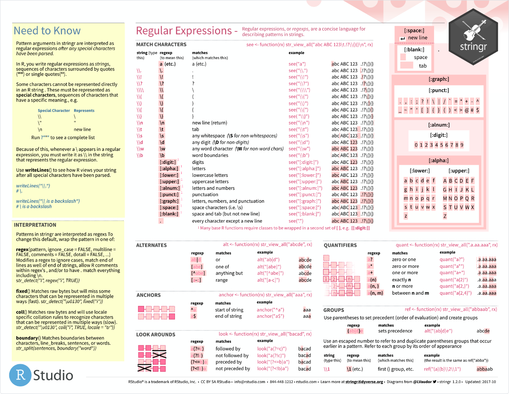
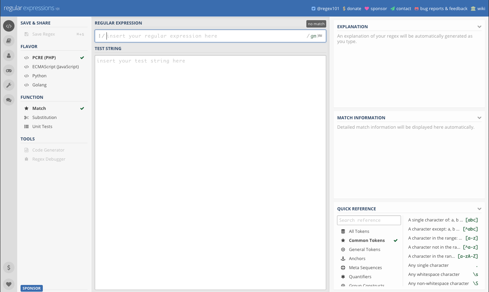

```{r setup, include=FALSE}
options(htmltools.dir.version = FALSE)
library(xaringanthemer)
style_mono_accent(
  text_font_google = google_font("Montserrat", "300", "300i"),
  code_font_google = google_font("Fira Mono")
)
library(magrittr)
library(flair)
```

<style>
:root {
  --font12: 12pt;
  --font10: 10pt;
  --font2: 2pt;
  --nyu-yellow: #ecaa00;
  --nyu-red: #c50f3c;
  --nyu-violet: #57068c;
}

.font12 > table {
  font-size: var(--font12);
}

.font12 > p {
  font-size: var(--font12);
}

.font12 > pre .remark-code-line {
  font-size: var(--font12);
}

.font10 > table {
  font-size: var(--font10);
}

.font10 > p {
  font-size: var(--font10);
}

.font10 > pre .remark-code-line {
  font-size: var(--font10);
}

.font10 > pre {
  font-size: var(--font10);
}

.font2 > pre {
  font-size: var(--font2);
}

.font10 .str_view {
  font-size: var(--font10);
}

.font10.rendered > pre {
  font-size: var(--font10);
  font-family: var(--code-font-family);
  background-color: #fdf6e3;
  color: #657b83;
  padding: 5px;
}

.yellow {
  color: var(--nyu-yellow);
}

.red {
  color: var(--nyu-red);
}

.violet {
  color: var(--nyu-violet);
}

.highlighted {
  background-color: var(--code-highlight-color);
}

.highlighted-block {
  font-family: var(--code-font-family), Menlo, Consolas, Monaco, Liberation Mono, Lucida Console, monospace;
}

</style>

# Last Time

We talked about:

- Row-binding
- Joins
- Relational data models
- Overview of data visualization with ggplot2

---

# Agenda

By the end of this workshop, you should be able to understand this block of code:

```{r}
func <- function(x) {
  prefixes <- stringr::str_subset(x, "^[a-zA-Z0-9]+_")
  prefixes <- stringr::str_replace(prefixes, "_.*$", "")
  
  paste0(prefixes, collapse = ",")
}

words <- c(
  "CS1_001",
  "CS1_002",
  "Not matched"
)

func(words)
```

---

# Agenda

We'll be covering

- Pattern matching
- String manipulation
- Functions
- Iteration, a subsection of control flow

I'll have the **tidyverse** meta-package attached throughout the presentation.

```{r, message=FALSE, warning=FALSE}
library(tidyverse)
```

---
class: inverse, middle, center

# Words, words, words

## 📜 💀

---

```{r, include=FALSE}
cat_line <- function(...) {
  cat(..., "\n", sep = "")
}

map_chr <- function(.x, .f, ...) {
  vapply(.x, .f, character(1L), ...)
}

with_code_block <- function(code) {
  cat_line("<pre class=\"highlighted-block\">")
  force(code)
  cat_line("</pre>")
}

with_code_line <- function(x) {
  cat_line(
    glue::glue("<div class=\"remark-code-line\">{x}</div>")
  )
}

highlight_matching <- function(x, pattern) {
  highlighted <- map_chr(x, function(el) {
    gsub(paste0("(", pattern, ")"), "<span class=\"highlighted\">\\1</span>", el)
  })
  
  for (el in highlighted) {
    cat_line(el)
  }
}
```


# Pattern Matching

Strings are **frequently messy** in your raw data -- typos, inconsistent date entry, etc. Managing string data requires the use of **regular expressions**, a well-defined grammar that allows for pattern matching.

Let's look at some basic regular expressions. To identify matching sequences, we'll be using `str_view_all()` from the **stringr** package, a member of the Tidyverse.

.pull-left.font10[

```{r, eval=FALSE}
str_view_all(
  c("hi world", "hihi"),
  "hi"
)
```

All `str_*` functions follow a pattern where the first argument are the test strings, and the second argument is the pattern.

Note that there can be _multiple_ matching character sequences in a string.

]

.pull-right.font10[

```{r, results='asis', echo=FALSE}
str_view_all(c("hi world", "hihi"), "hi")
```

]

---

# Pattern Matching

Regular expressions (regex) are a sequence of **tokens**. All alphanumeric characters are tokens, including a few other sequences:

.pull-left.font10[

```{r, eval=FALSE}
"\\d" # Digit
"\\w" # Alphanumerics, including _
"\\s" # Whitespace
"."   # ANY character except newline
"\\." # A period / full-stop.
```

The `\\` is R's way of "escaping" the backslash character, which is used in non-regex sequences for significant characters, like '\\n' which signals a "newline" character. 

The prefix '\\U' is used for Unicode characters<sup>1</sup>, like '\\U1F913' which translates to `r "\U1F913"`.

In the case of "\\\\.", the escaped backslash tells the regular expression to treat `.` not as a special token but as a _literal_ dot. You can do the same with other special tokens like `+` and `$` (which we'll get to shortly).

]

.pull-right.font10[

```{r, results='asis', echo=FALSE}
str_view_all("Any digit: 1a2b45", "\\d")
str_view_all("All alphanumeric characters, including _", "\\w")
str_view_all("All whitespace (spaces, tabs, new lines)", "\\s")
str_view_all("ANY character except newline", ".")
str_view_all("A period/full-stop.", "\\.")
```

]

.footnote.font10[

(1): Technically, this is for the 4-byte Unicode characters, to which the emoji belong. Use '\\u' for the 2-byte characters (if the Unicode hex code only has 4 characters).

]

---

# Pattern Matching

If you want to match multiple tokens/characters, use the `*`, `+`, and `{}` suffix tokens. Use `?` to _optionally_ look for a pattern (zero or one matches)

.pull-left.font10[

```{r, eval=FALSE}
"a+"       # One or more 'a' characters
"z*"       # Zero or more 'z' characters
"\\d{2,3}" # Between 2 and 3 digits
"\\w{5}"   # 5 contiguous letters
"b?"       # Zero or one b characters
```

]

.pull-right.font10[

```{r, results='asis', echo=FALSE}
str_view_all("One or more characters: baab", "a+")
str_view_all("Zero or more characters: zzzero", "z*")
str_view_all("Between 2 and 3 digits: 2345", "\\d{2,3}")
str_view_all("5 contiguous letters", "\\w{5}")
str_view_all("Zero or one b characters", "b?")
```

]

---

# Pattern Matching

Use `[]` to select "classes" of characters:

.pull-left.font10[

```{r, eval=FALSE}
"[abc]+"    # One or more of 'a', 'b', or 'c'
"[a-z]"     # Any lowercase letter
"[^a]"      # Any character BUT 'a'
"[A-Z0-9+]" # All caps, numbers, and '+'
```

]

.pull-right.font10[

```{r, results='asis', echo=FALSE}
str_view_all("One or more of 'a', 'b', or 'c': abcdab", "[abc]+")
str_view_all("Any lowercase letter", "[a-z]")
str_view_all("Any character BUT 'a'", "[^a]")
str_view_all("All caps, numbers, and '+'", "[A-Z0-9+]")
```

]

---

# Pattern Matching

Regular expressions work by starting at the beginning of the test string and marching along to the end, one character at a time. Thus, it's very possible to have multiple matches, when you really only cared about the start or end of a string. To address this, there are two **anchor** characters `^` (start) and `$` (end):

.pull-left.font10[

```{r, eval=FALSE}
"^Starts"  # Starts with 'Starts'
"\\.docx$" # Ends in '.docx'
```

]

.pull-right.font10[

```{r, results='asis', echo=FALSE}
str_view_all("Starts with 'Starts'", "^Starts")
str_view_all("Ends in '.docx': test-file.docx", "\\.docx$")
```

]

---

# Pattern Matching

You can also look for **unions** of patterns using the union bar `|`. If you want to have "subpatterns", use **capture groups** with `()`:

.pull-left.font10[

```{r, eval=FALSE}
"this|that"        # "this" OR "that"
"(this|that) word" # "this..." OR "that..."
```

]

.pull-right.font10[

```{r, results='asis', echo=FALSE}
str_view_all("'this' or 'that'", "this|that")
str_view_all("Matches 'this word' or 'that word'", "(this|that) word")
```

]

While you _can_ have nested capture groups (e.g. `^(group(_[ab])?))`) in a regex, there is **no** knowledge of structure hierarchy. Capture groups are evaluated by the number of `(` token incidences.

We'll come back to capture groups in a bit when we talk about string _manipulation_...

---
class: center, middle

[](https://github.com/rstudio/cheatsheets/blob/master/strings.pdf)

---
class: center, middle

[](https://regex101.com/)

---

.center[

## ⚠️ Regex Caution ⚠️

Regular expressions are very powerful, but they can be abused.

]

**You cannot use regular expressions alone to parse recursive or nested data**. This is a common mistake due to a misunderstanding of how regexes work. They operate **linearly** and (nearly) **memoryless**. For example, if you tried to create a regex that parses HTML in general (like `<html><body><p>HI!</p></body></html>`), it would fail because it doesn't keep track of the tag level (say, with a count of number of open tags).

**Regular expressions are not a panacea.** Very rarely do regexes describe a pattern for an entire string structure. Instead, they are used to define smaller components of a larger structure _because_ they cannot be used with recursive/nested data. The canonical example is "the" regex for identifying email addresses: [RFC822](http://www.ex-parrot.com/~pdw/Mail-RFC822-Address.html). Even this monstrosity does not cover all cases. [See this StackOverflow thread for more information](https://stackoverflow.com/questions/201323/how-to-validate-an-email-address-using-a-regular-expression/201378#201378).

---

# Recap

.pull-left[

How would I match these strings: "AR1234", "BR9204", and "AR0392"? You can assume that "R" is fixed and there are four digits.

]

.pull-right[

1. `A?B?R\\d{,4}`
1. `[AB]?R\\d{4}`
1. `[AB]R\\d{4}`
1. `[AB]R\\d{,4}`

]

---

# Recap

.pull-left[

How would I match these strings: "AR1234", "BR9204", and "AR0392"? You can assume that "R" is fixed and there are four digits.

]

.pull-right[

1. `A?B?R\\d{,4}`
1. `[AB]?R\\d{4}`
1. <span class="highlighted">`[AB]R\\d{4}`</span>
1. `[AB]R\\d{,4}`

]

---

# String Manipulation

Regular expressions are the **cornerstone** of string manipulation tools. Frequent operations include:

- **Concatenating**: Combining multiple strings into one
- **Searching**: Finding strings that match a pattern
- **Splitting**: Splitting up a string based on some delimiter
- **Substitution**: Swapping bits of matched text with other text

---

# Concatenation

The most straightforward operation with strings, **concatenation**, does not require regular expressions. It literally is joining two strings together. To do this, we use the `str_c()` function (remeniscent of `c()`):

.pull-left.font10[

```{r, eval=FALSE}
str_c("a", "b")

x <- letters[1:6]
str_c(x, "_", LETTERS[1:6])

paste0(x, "_", LETTERS[1:6]) # Base R equiv
```

]

.pull-right.font10[

```{r, echo=FALSE}
print(str_c("a", "b"))

x <- letters[1:6]
print(str_c(x, "_", LETTERS[1:6]))

paste0(x, "_", LETTERS[1:6])
```

]

`str_c()` can take an arbitrary number of arguments. As shown in the second output, `str_c()` is _vectorized_ over each of its arguments, applying the function to each of the arguments' elements in a coherent manner.

Also note that `"_"` is _not_ an object (technically a **vector**) with 6 elements. `str_c()` uses **recycling** to repeat the underscore 6 times to match the lengths of the other vectors.

Note that argument order matters! `str_c("a", "b")` is not the same as `str_c("b", "a")`.

---

# Interpolation

A kind of concatenation is **interpolation**, where some "template string" is propagated with variables defined in your working environment. In R, this is achieved using the **glue** package -- included with **stringr**. The idea is that you wrap the symbol of your variable in braces `{}` _inside_ of a string. Then you give that template string to `str_glue()` and its relatives:

.pull-left.font10[

```{r}
given_name <- "Patrick"

str_glue("Hello, {given_name}!")
```

For variables defined in the working environment...

]

.pull-right.font10[

```{r}
str_glue_data(
  head(mtcars, 3), 
  "Miles per gallon: {mpg}"
)
```

... for variables defined in a dataset.

]

`str_glue()` and `str_glue_data()` are _very_ handy tools if you're combining many strings together.

---

# Searching

Often we need to select strings from text that match a pattern. There are several tools at our disposal depending on our task. We'll use the corpus `stringr::words` to examine these.

Let's find all words that have doubled letters. Use `str_subset()` to get the subset directly:

.pull-left.font10[

```{r, eval=FALSE}
# grep("(\\w)\\1", stringr::words, value = TRUE) -- base R equivalent
str_subset(stringr::words, "(\\w)\\1")
```

`\\1` is a _backreference_. It refers to whatever was captured in the first capture group, `(\\w)`.

]

.pull-right.font10[

```{r, echo=FALSE}
print(str_subset(stringr::words, "(\\w)\\1"), max = 40)
```

]

That's a lot of matches! We can use `str_count()` to get the fully tally of matches. This counts the number of matches _per element_, so all we care about is if there are more than zero matches:

.font10[

```{r}
sum(str_count(stringr::words, "(\\w)\\1") > 0)
```

]

---

# Searching

However, sometimes we just need a **logical** vector of `TRUE`/`FALSE` results, useful for filtering with `dplyr::filter()`. For this we use `str_detect()`:

```{r}
# grepl("(\\w)\\1", stringr::words) -- Base R equivalent
sum(str_detect(stringr::words, "(\\w)\\1")) # Should be 157!
```

Other times we need the direct indices for each matching element in a vector. For this, we use `str_which()`:

```{r, eval=FALSE}
# grep("(\\w)\\1", stringr::words) -- Base R equivalent
str_which(stringr::words, "(\\w)\\1")
```

```{r, echo=FALSE}
# grep("(\\w)\\1", stringr::words) -- Base R equivalent
print(str_which(stringr::words, "(\\w)\\1"), max = 40)
```

---

# Searching

We can also recover **matching substrings** using `str_extract()`:

```{r}
str_extract("rabbit", "(\\w)\\1")
```

If there's no match, `str_extract()` returns `NA`:

```{r}
str_extract("rabid", "(\\w)\\1")
```

---

# Splitting

Very often, text is joined together with a delimiter. Think of this sentence: its words are separated by whitespace and a colon! To split text into constituent elements, we use `str_split()`:

.font10[

```{r, eval=FALSE}
sentence <- "This is a sentence that I'd like to get the words from"

str_split(sentence, "\\s+") # Recall that \\s means all whitespace!
```

]

--

.font10[

```{r, echo=FALSE}
sentence <- "This is a sentence that I'd like to get the words from"

str_split(sentence, "\\s+") # Recall that \\s means all whitespace!
```

]

Huh. Strange output. What's that `[[1]]` mean? Let's try a longer input character vector:

.font10[

```{r, eval=FALSE}
sentences <- c(
  "This is one sentence",
  "This is another"
)

str_split(sentences, "\\s+")
```

]

--

.font10[

```{r, echo=FALSE}
sentences <- c(
  "This is one sentence",
  "This is another"
)

str_split(sentences, "\\s+")
```

]

---

# Splitting

The `str_split()` operation returns a **list**:

```{r}
str(str_split(sentences, "\\s+"))
```

**List**s are generalized "container" objects that can contain _heterogeneous_ data, unlike **vectors** which are _homogeneous_.

--

Why does `str_split()` do this? All of the data is of the same type, right?

--

Technically, no. Vectors are characterized by having each of its elements being the same type **and** length 1. Consider how mathematical vector components can be described by $N \times 1$ matrices. Since the splitting operation cannot guarantee the output length for each element, `str_split()` boxes the elements into a list (sometimes referred to as a "ragged list").

---

# Splitting

So how do we access the results? As the `[[1]]` suggests, we use the `[[` operator:

```{r}
results <- str_split(sentences, "\\s+")

results[[1]]
```

While I have used `[` in the past with vectors (e.g. `letters[1:6]`), we need to be more careful with lists. `[` is technically known as the _slice operator_. Slicing is well-defined for vectors, but lists are a little funky. They are the fundamental building block of most custom R objects, and for that reason R allows `[` to be **overriden** for different R objects. Thus, `[` is not always well-defined, so it's better to use `[[` when you want to access a specific element.

When we discuss `for` loops in a bit, it will become _much_ easier to work with these objects.

---

# Substitution

Finally, sometimes it's useful to replace, or even remove, text based on some matching pattern. This is conducted with `str_replace(x, pattern, replacement)`. I'll demonstrate with a piece of real data.

In one of our datasets, we have column names that looked like "G102041", which are very difficult to understand in this structure. For intermediate data cleaning, I renamed these columns to make them easier to understand:

```{r}
str_replace(
  "G102041", 
  "^G(\\d)(\\d{2})(\\d{2})(\\d)",
  "game_\\2_session_\\4_day_\\1_week_\\3"
)
```

Since the `replacement` argument allows backreferences with `["\\1", "\\2", ..., "\\n"]`, we can move matching text around with ease -- taking full advantage of capture groups!

---

# Recap

.pull-left[

CSV (comma-separated value) documents are a type of tabular dataset where each field is separated by a comma ','. Each row is on its own text line. Sometimes, fields have text that contain their own commas. When this happens, the field is usually quoted with double-quotes '"'. Given this knowledge, is it simple enough to get each field per row using `str_split(row, "\\,")`?

]

.pull-right.middle[

1. **Yes**, the quotes contain the comma, making the split safe.
1. **No**, this forms a kind of hierarchical structure which cannot be handled with regexes alone.

]

---

# Recap

.pull-left[

CSV (comma-separated value) documents are a type of tabular dataset where each field is separated by a comma ','. Each row is on its own text line. Sometimes, fields have text that contain their own commas. When this happens, the field is usually quoted with double-quotes '"'. Given this knowledge, is it simple enough to get each field per row using `str_split(row, "\\,")`?

]

.pull-right.middle[

1. **Yes**, the quotes contain the comma, making the split safe.
1. <span class="highlighted">**No**, this forms a kind of hierarchical structure which cannot be handled with regexes alone.</span>

]

---
class: middle, center, inverse

# Functions and For Loops
## ♻️ 🔁

---

# Functions

It's now time to learn _how_ to write an R function. As mentioned in session 1, functions are atomic building blocks of reusable code. Moreover, R is first and foremost a *functional* language. John M. Chambers, the author of the S language (R's direct ancestor) puts it this way:

> Everything that exists is an object. Everything that happens is a function call.
> -- _John M. Chambers, [arXiv:1409.3531v1](https://arxiv.org/abs/1409.3531v1)_

Even though it's common to see very long analysis scripts with no user-defined functions, this was **not** the intention of the R authors.

---

# Functions

What does a function consist of? 

Three things: a name, arguments, and a body:

```{r func_desc, include=FALSE}
say_hi <- function(x) {
  stringr::str_glue("Hi, {x}!")
}
```
```{r, echo=FALSE}
decorate("func_desc") %>% 
  flair("say_hi", background = "pink") %>%
  flair("(x)", background = "yellow") %>% 
  flair("stringr::str_glue(\"Hi, {x}!\")", background = "AliceBlue")
```

Call this function with `say_hi()`:

```{r}
say_hi("Charles")
```

---

# Functions

Function arguments **do not modify** already existing variables in "calling environments":

.pull-left[

```{r, eval=FALSE}
x <- "Bob"

say_hi_again <- function(x) {
  x <- stringr::str_c(x, " Jones")
  stringr::str_glue("Hi, {x}!")
}

say_hi_again("Bob")

print(x)
```

]

.pull-right[

```{r, echo=FALSE}
x <- "Bob"

say_hi_again <- function(x) {
  x <- stringr::str_c(x, " Jones")
  stringr::str_glue("Hi, {x}!")
}

say_hi_again("Bob")

print(x)
``` 

]

This is a key feature of function creation, known as _lexical scoping_. Strictly speaking, the bodies of functions are evaluated in _different_ environments than the calling environment.

---

# Functions

_When_ do you write a function? The common mantra is that when you have written the same **chunk** of code over and over again, it's an indication that you should rewrite it in a function.

Let's take the mode. Strangely enough, R does not define a built-in function for taking the mode. Writing that code every time we wanted to take the mode would be cumbersome, so let's write a function.

--

The first thing to do when writing a function is to consider its inputs and outputs. For us, we want to take a vector -- any vector -- and return the mode of the vector elements. Let's start there:

```{r}
vec_mode <- function(x) {
  x
}
```

Style note: function bodies should be indented once. A common R style is to set an indent at two spaces. The opening brace should be after the `function()` call **with a space between the closing paren and the open brace**. The closing brace should be on its own line, with no indent.

---

# Functions

```{r, eval=FALSE}
vec_mode <- function(x) {
  x
}
```

Decent start. What's important to note is that the **last line of functions is assumed to be the value of the function**. Since `x` is the last line, `x` will be returned to the calling environment:

```{r}
vec_mode(1:5)
```

Now let's work on finding the mode.

---

# Functions

We first want to pick out the **set** of values in the input vector. Getting us the set of values is a stepping point of getting a tabulation of the set. Getting the set is achieved with `unique()`.

```{r}
vec_mode <- function(x) {
  ux <- unique(x)
  
  ux
}

vec_mode(c(1, 1, 2))
```

OK now we've got the set. Now let's compare this with a tabulation.

---

# Functions

To get frequency counts, we need to use `tabulate()` and `match()`. `match()` performs a lookup of a value against a table of values and returns a vector of matching table indices. `tabulate()` counts the number of times each index appears, a perfect candidate for creating our mode function!

```{r}
vec_mode <- function(x) {
  ux <- unique(x)
  tabulated <- tabulate(match(x, ux))
  
  tabulated
}

vec_mode(c(1, 1, 2))
```

Looks like we got the right counts! Since this is a comparison against the _set_ (which is `{1, 2}`) it looks like R is telling us that `1` has 2 matches while `2` has 1.

---

# Functions

Finally, let's use `which.max()` to get the element with the largest count:

```{r}
vec_mode <- function(x) {
  ux <- unique(x)
  tabulated <- tabulate(match(x, ux))
  
  ux[which.max(tabulated)]
}

vec_mode(c(1, 1, 2))
```

.center[

#### 🎉

]

We did it! Of course, writing a function from scratch like this isn't _ever_ as straightforward. Usually you already have some code that you need to restructure somehow, or you're scouring StackOverflow to find a function/approach that'll help you solve your problem. **This is absolutely, positively, 100% normal**. I do this **every day**.

---

# Functions

Let's give `vec_mode()` some input data, shall we? Let's say we do 5 draws of `stringr::words` to generate random "sentences" of 10 words. To increase the chance of repeats, let's work with a subset of the corpus.

```{r}
set.seed(2003)
words_subset <- sample(stringr::words, 50)

sentences <- c(
  paste0(sample(words_subset, 10, replace = TRUE), collapse = " "),
  paste0(sample(words_subset, 10, replace = TRUE), collapse = " "),
  paste0(sample(words_subset, 10, replace = TRUE), collapse = " "),
  paste0(sample(words_subset, 10, replace = TRUE), collapse = " "),
  paste0(sample(words_subset, 10, replace = TRUE), collapse = " ")
)
```

Well... that was hideous to type. If only there were a better way to do repeated tasks like this...

---

# Iteration

Ahh yes, a loop! We're repeating this sentence creation task five times, so let's create an empty character vector with 5 slots, and then for each slot create the "sentence"!

```{r}
set.seed(2003)
sentences <- character(5)

for (i in seq_along(sentences)) {
  sentences[[i]] <- paste0(sample(words_subset, 10, replace = TRUE), collapse = " ")
}
```

... what's going on?

---

# Iteration

`for` loops have a basic structure:

```{r, eval=FALSE}
for (element in collection) {
  # ... Do something
}
```

The pattern of "preallocating" a container that you'll modify:

```{r, eval=FALSE}
container <- abstract_container_with_size(5)

for (index in seq_along(container)) {
  container[[index]] <- some_action()
}
```

is something you _should_ do. Previously, one of the major complaints of R is that its `for` loops were slow. That has been addressed somewhat, but this design pattern _completely_ removes the problem that was causing the slowness.

---

# Iteration

So what did the iteration code do?

```{r}
sentences
```

Nice! Now, let's split up these sentences, and with our new mastery of `for` loops find the mode of each sentence.

---

# Iteration

Recall that `str_split()` creates a `list`, so when we iterate over the output list, we should use `[[`.

```{r}
split_list <- str_split(sentences, "\\s+")
mode_chr <- character(length(split_list))

for (i in seq_along(mode_chr)) {
  mode_chr[[i]] <- vec_mode(split_list[[i]])
}

mode_chr
```

And with that, we have reduced code that may have taken tens of lines down to just 6. This makes it easier for you to understand _and_ debug. The fewer times you write the same bit of code, the less likely you'll introduce bugs!

In the next and last session of 2020, we'll discuss functional programming in more depth, including tools that allow you to remove some of this boilerplate code and manage complex projects better.

---

# Recap

.pull-left[

Suppose you had a function defined thus:

```{r, eval=FALSE}
map <- function(x, f) {
  out <- vector("list", length(x))
  
  for (i in seq_along(x)) {
    out[[i]] <- f(x[[i]])
  }
  
  out
}
```

What are the input types? What is the output type?

]

.pull-right[

1. The inputs are a collection and a function, respectively, and the output is a vector.
1. The inputs are a collection and a function, respectively, and the output is a list.
1. The inputs are a function and a collection, respectively, and the output is a vector.
1. It's not possible to determine the types from this snippet.

]

---

# Recap

.pull-left[

Suppose you had a function defined thus:

```{r, eval=FALSE}
map <- function(x, f) {
  out <- vector("list", length(x))
  
  for (i in seq_along(x)) {
    out[[i]] <- f(x[[i]])
  }
  
  out
}
```

What are the input types? What is the output type?

]

.pull-right[

1. The inputs are a collection and a function, respectively, and the output is a vector.
1. <span class="highlighted">The inputs are a collection and a function, respectively, and the output is a list.</span>
1. The inputs are a function and a collection, respectively, and the output is a vector.
1. It's not possible to determine the types from this snippet.

]

---

# Exercise

There is a problem with the definition of `vec_mode()`: it cannot handle ties well.

```{r}
vec_mode(c(1, 2, 1, 2))
```

If you only care about the _first_ match, then it's acceptable. However, if you care about _all_ elements that are the most frequent, then we'll need to modify the code a bit.

**Using dplyr and whatever else you know**, come up with another implementation of `vec_mode()` that reports these kinds of ties.


