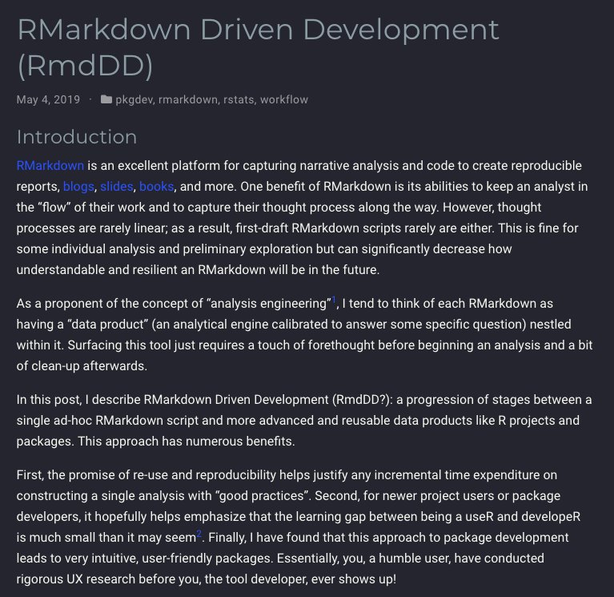

```{r setup, include=FALSE}
options(htmltools.dir.version = FALSE)
library(xaringanthemer)
style_mono_accent(
  text_font_google = google_font("Montserrat", "300", "300i"),
  code_font_google = google_font("Fira Mono")
)
library(magrittr)
library(flair)
```

<style>
:root {
  --font12: 12pt;
  --font10: 10pt;
  --font2: 2pt;
  --nyu-yellow: #ecaa00;
  --nyu-red: #c50f3c;
  --nyu-violet: #57068c;
}

.font12 > table {
  font-size: var(--font12);
}

.font12 > p {
  font-size: var(--font12);
}

.font12 > ul {
  font-size: var(--font12);
}

.font12 > pre .remark-code-line {
  font-size: var(--font12);
}

.font10 > table {
  font-size: var(--font10);
}

.font10 > p {
  font-size: var(--font10);
}

.font10 > pre .remark-code-line {
  font-size: var(--font10);
}

.font10 > pre {
  font-size: var(--font10);
}

.font2 > pre {
  font-size: var(--font2);
}

.font10 .str_view {
  font-size: var(--font10);
}

.font10.rendered > pre {
  font-size: var(--font10);
  font-family: var(--code-font-family);
  background-color: #fdf6e3;
  color: #657b83;
  padding: 5px;
}

.yellow {
  color: var(--nyu-yellow);
}

.red {
  color: var(--nyu-red);
}

.violet {
  color: var(--nyu-violet);
}

.highlighted {
  background-color: var(--code-highlight-color);
}

.highlighted-block {
  font-family: var(--code-font-family), Menlo, Consolas, Monaco, Liberation Mono, Lucida Console, monospace;
}

</style>

# Last Time

We talked about:

- Pattern matching
- String manipulation
- Function writing
- Iteration

---

# Agenda

Most of the workshop will be more about project structure, however...

By the end of this workshop, you should be able to understand this block of code:

.font10[

```{r, eval=FALSE}
library(drake)

drake_plan(
  raw_data = readxl::read_excel(file_in("raw_data.xlsx")),
  data = raw_data %>%
    mutate(Ozone = replace_na(Ozone, mean(Ozone, na.rm = TRUE))),
  hist = create_plot(data),
  fit = lm(Ozone ~ Wind + Temp, data),
  report = rmarkdown::render(
    knitr_in("report.Rmd"),
    output_file = file_out("report.html"),
    quiet = TRUE
  )
)
```

]

---

# Agenda

We'll be covering

- R-script based project structures
- R "package" project structure
- Controlling code complexity
- **drake**
- Functional programming

I'll have the **tidyverse** meta-package attached throughout the presentation.

```{r, message=FALSE, warning=FALSE}
library(tidyverse)
```

---
class: inverse, middle, center

# Project Structures

## 🗄 🗄 🗄 

---

# Project Structures in R

There are several styles of R project out there, and it can be daunting to choose the "best" one. Like most things in life, **there is no "best" project style**. Each has their pros and cons.

These are the project "styles" we'll cover today:

1. R-script based project
1. R Markdown based project
1. R package project
1. **drake** project

The order of these _roughly_ translates to the size of the project, from the smallest scale to largest.

---

# R-script Projects

The simplest structure is the R script. For very, _very_ small projects, it's sufficient to use a single R script:

.pull-left.font10[

<pre>
project/
  data/
    .. All data are stored here ..
  assets/
    .. All derived assets (reports and whatnot) ..
  make.R
</pre>

]

.pull-right.font10[

```{r, eval=FALSE}
# make.R
library(tidyverse)

dat <- read_csv(here::here("data/dataset.csv"))

# ... Do stuff ...

save_results(results, file = here::here("assets/results.dat"))
```


]

All code is stored in the "make.R" file, and its layout roughly follows:

1. Attach required packages with `library()`
1. Load required datasets
1. Do stuff to the data to get results
1. Save results

Each time you change your code or input data, you `source()` the "make.R" script and rerun the code. As you can imagine, this can get unwieldy pretty quickly...

---

# R-script Projects

The usual solution to having this in a single script is to have multiple topic or stage scripts with one master script. To ensure that the stages are loaded in order, the scripts are prefixed with `00-`, `01-`, `02-`, and so on. Often, these scripts are stored in a separate directory, named "code", "analysis", or other. I prefer to name this folder "R" to follow the R package convention (discussed later).

.pull-left.font10[

<pre>
project/
  R/
    00-libraries.R    # library() calls
    01-data-loading.R
    02-wrangling.R
    ...
  make.R
  ...
  project.Rproj
</pre>

Remember: using RStudio projects (the "project.Rproj" file) ensures that calls to `here::here()` refer to the project root `project/`! 

]

.pull-right.font10[

```{r, eval=FALSE}
# make.R
#!/usr/bin/env Rscript #<<

all_scripts <-
  list.files(
    here::here("R"), 
    full.names = TRUE
  )

for (script in all_scripts) {
  source(script)
}
```

The number prefixes ensure that the scripts are loaded in order, as `list.files()` returns the file names _alphabetically_.

]

---

# R Markdown Projects

These are similar to pure R-script projects. Rather than having a master "make.R" file that `source()`s all of the R scripts, you use a master R Markdown document. Usually, the end result of a project is some report, paper, or other human-readable asset that you intend to share, so it's only fitting that you do all your writing in an executable R Markdown document while loading in supplemental scripts.

.pull-left.font10[

<pre>
project/
  R/
    00-libraries.R    # library() calls
    01-data-loading.R
    02-wrangling.R
    ...
  report.Rmd
  ..
</pre>

Right: Blog post by Emily Riederer, a major propronent of "RMarkdown Driven Development"

]

.pull-right.font10[

[](https://emilyriederer.netlify.app/post/rmarkdown-driven-development/)

]

---

## R-Script & R Markdown Project Cost/Benefit

The costs/benefits of these project styles are similar, so I'll evaluate them together.

.pull-left[

**Benefit**:

- Good for small-medium scale projects with _few_ outputs
- Easy to comprehend code flow via prefixed "R" folder
- Not much infrastructure required

]

.pull-right[

**Cost**:

- Difficult to add new stages
- Updating code lends itself to rerunning the _entire_ project, wasting time on already-built phases<sup>1</sup>
- Maintaining larger-scale scripts without proper testing is _very_ difficult

]

.footnote.font10[

(1): R Markdown -- through **knitr**, the rendering engine -- has the ability to cache chunk outputs, cutting down on build time. However, **knitr**'s cache is very easily invalidated, so it often rebuilds OK chunks anyway.

]

---
class: center, middle, inverse

# Managing Project Complexity
## 📦 ✅

---

# The R Package Structure

How do you know your code is correct? How do you know if your built assets are outdated? How do you save time on computation? How do you track your project dependencies?

R scripts on their own do **not** have an existing infrastructure to help you deal with these questions. To address this, there are several tools at your disposal -- if you use the right project structure: the R package structure.

.pull-left.font12[

As we discussed in the first session, R packages are primarily vessels to share user-created functions (and sometimes datasets). Structurally, they follow the folder layout to the right.

All package metadata (title, authors, links) are stored in the `DESCRIPTION` file. This also includes a list of **package dependencies** -- a necessity for being able to share your work!

]

.pull-right.font10[

<pre>
package/
  data/        # Shared data
    ...
  DESCRIPTION  # Package metadata*
  LICENSE      # License text
  man/         # Package help pages*
    ... 
  NAMESPACE    # Import/export list*
  R/           # All R source files*
    ...
  tests/       # Unit test scripts
    ...
  vignettes/   # Long-form docs and examples
    ...
</pre>

]

---

# The R Package Structure

For your average project, it's usually overkill to include _all_ of these components. Unless you want to your project _as_ an R package, you don't need the `man`, `NAMESPACE`, and `vignettes` components. However, when you use the R package structure, you get access to the R package development infrastructure:

.pull-left[

- **devtools**: Common development operations (building, testing, rendering documentation, etc)
- **usethis**: Typical project setup and management operations
- **testthat**: Test your source code to make sure it behaves correctly

]

.pull-right.center[


]

---

# Workflows & Drake

For larger projects, the process of adding new code and then rerunning your project master script is inherently a **slow** workflow. Trying to cut down on this time by using an R Markdown file and running chunks as needed is an option, but this introduces problems with **code dependencies**. A better and more scalable process would be to identify discrete "build stages" that can be **cached**, stored for later use unless the input data or code changes. If these dependencies don't change, then computation time is significantly cut down.

.pull-left[

**This is the goal of `drake`**.

You define a `drake_plan()` object (a collection of "targets" or build steps), and then **drake** inspects your code to determine the dependencies for each target: code, files, _and_ packages.

]

.pull-right.center[

[](https://github.com/ropensci/drake)

]

---

# Using Drake

**drake**, like other general projects, uses a relaxed R package file structure with some additions:

.pull-left.font10[

<pre>
project/
  _drake.R
  config/
    packages.R
    plan.R
  R/
    .. Custom functions for your project ..
  ...
</pre>

The "_drake.R" file acts as the master build script. "packages.R" contains all `library()` calls for attached packages that you use throughout the project. The "plan.R" file contains the `drake_plan()` object that defines the build targets. Taken together, all three constitute the components necessary to run the **drake pipeline**.

A basic "_drake.R" is defined on the right.

]

.pull-right.font10[

```{r, eval=FALSE}
# _drake.R
f_sources <-
  list.files(
    here::here("R"), 
    full.names = TRUE
  )

for (func_source in f_sources) {
  source(func_source)
}

# Set Drake configuration
source(here::here("config/packages.R"))
source(here::here("config/plan.R"))

drake_config(
  the_plan,
  verbose = TRUE
)
```

]

---

# Using Drake

.pull-left.font12[

**drake** plans are where the _runnable steps_ are defined. To track fie dependencies, there are a couple helper functions that signal to **drake** to watch the files:

- `file_in(file)`: Looks to see if the input `file` exists or has changed
- `knitr_in(file)`: Like `file_in()` for R Markdown files, but also inspects the document's code for its dependencies
- `file_out(file)`: Looks to see if the `file` has been deleted and needs to be rebuilt

]

.pull-right.font10[

```{r, eval=FALSE}
# config/plan.R
the_plan <- drake_plan(
  raw_data = readxl::read_excel(
    file_in("raw_data.xlsx")
  ),
  
  data = 
    raw_data %>%
    mutate(
      Ozone = replace_na(
        Ozone, 
        mean(Ozone, na.rm = TRUE)
      )
    ),
  
  hist = create_plot(data),
  
  fit = lm(Ozone ~ Wind + Temp, data),
  
  report = rmarkdown::render(
    knitr_in("report.Rmd"),
    output_file = file_out("report.html"),
    quiet = TRUE
  )
)

```

]

---
class: center, middle

# [_A Demo Project_](https://github.com/nyuglobalties/test-data-project)

---

# Functional Programming

.pull-left[

You can see that each target in the **drake** plan is defined as a function or chain of functions. This is the preferred style of **drake** since it fits the design philosophy of R. 

**Functional programming** is a style of coding where you _compose_ together functionality with **function composition**. In essence, composing functions together allows you to focus on _what_ should your code be doing. This contrasts with sequential script-based development which focuses on _how_ your code should be working.

]

.pull-right.font10[

```{r, eval=FALSE}
the_plan <- drake_plan(
  raw_data = readxl::read_excel(
    file_in("raw_data.xlsx")
  ),
  
  data = 
    raw_data %>%
    mutate(
      Ozone = replace_na(
        Ozone, 
        mean(Ozone, na.rm = TRUE)
      )
    ),
  
  hist = create_plot(data),
  
  fit = lm(Ozone ~ Wind + Temp, data),
  
  report = rmarkdown::render(
    knitr_in("report.Rmd"),
    output_file = file_out("report.html"),
    quiet = TRUE
  )
)
```

]

---

# Functional Programming

Recall last session's recap question with this code snippet with the definition of `map()`, a **higher-order function** (a function that modifies/uses an input function):

.font10[

```{r}
map <- function(x, f) {
  out <- vector("list", length(x))
  
  for (i in seq_along(x)) {
    out[[i]] <- f(x[[i]])
  }
  
  out
}
```

]

Note how all this function does is wrap the standard `for` loop design pattern. It's not uncommon to have to write `for` loops of this kind. However, which of these statements is more intelligible?

.pull-left.font10[

```{r, eval=FALSE}
out <- vector("list", length(x))
  
for (i in seq_along(x)) {
  out[[i]] <- do_a_thing(x[[i]])
}

out
```

]

.pull-right.font10[

```{r, eval=FALSE}
map(x, do_a_thing)
```

]

---

# Functional Testing

.font12[

Breaking down your code into a collection of functions that can be composed together makes your project **testable  through unit tests**. A unit test is some code that makes some expectations of the behavior of the function you're testing. If any of those expectations are not met, the unit test fails. This allows you to define your code's behavior and **safeguard your project from future breaking changes**.

]

.pull-left.font12[

We achieve this using **testthat**. Some **testthat** unit tests look like this:

```{r, include=FALSE}
library(testthat)
```
```{r}
test_that("map() behaves correctly", {
  expect_equal(
    map(1:5, function(el) el^2), 
    list(1, 4, 9, 16, 25)
  )
})
```

]

.pull-right.center.middle[

## _Demo_

]

---

# Functional Programming

.font12[

Functional programming is not just dedicated to abstracting away the boilerplate code for common design patterns, e.g. higher-order functions like `map()`. It's also a helpful way to mentally process your code since it describes _what_ is going on in a human-readable manner. Consider the template `drake_plan()`:

]

.pull-left.font10[

```{r, eval=FALSE}
the_plan <- drake_plan(
  raw_data = readxl::read_excel(
    file_in("raw_data.xlsx")
  ),
  
  data = 
    raw_data %>%
    mutate(
      Ozone = replace_na(
        Ozone, 
        mean(Ozone, na.rm = TRUE)
      )
    ),
  
  hist = create_plot(data),
  
  fit = lm(Ozone ~ Wind + Temp, data),
  
  report = rmarkdown::render(
    knitr_in("report.Rmd"),
    output_file = file_out("report.html"),
    quiet = TRUE
  )
)
```

]

.pull-right.font12[

Note how it's pretty easy to follow the plan to see what's happening. **That is the intended design**. You should be able to scan the plan and at a higher level understand the code flow. The minutia and implementation details are located out-of-sight, preferably in well-tested functions composed together.

**Rule of thumb**: if the code for a specific action is _longer than 20 lines_, you should rewrite that code into a collection of smaller functions.

]

