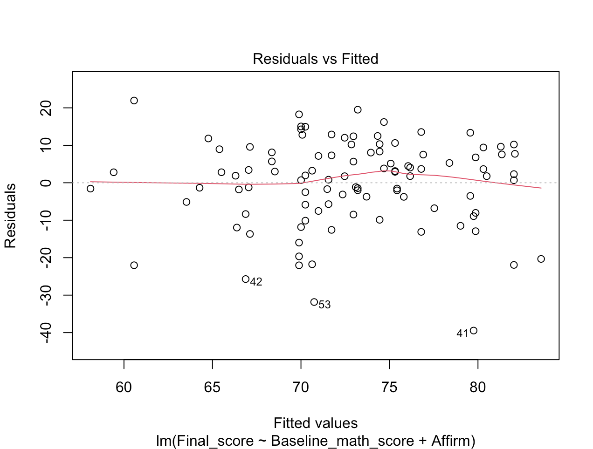
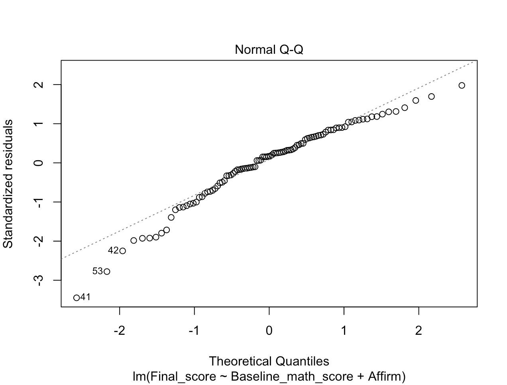
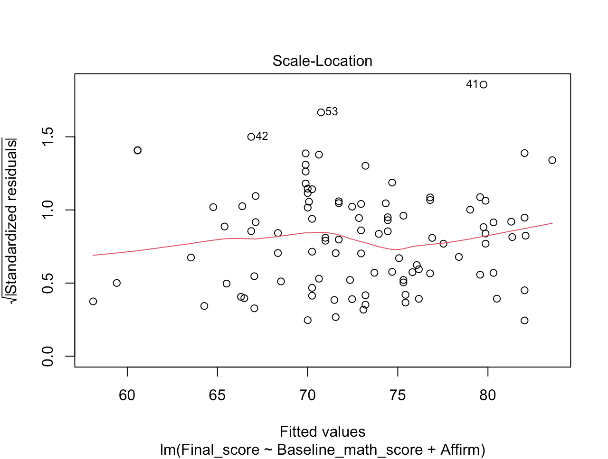
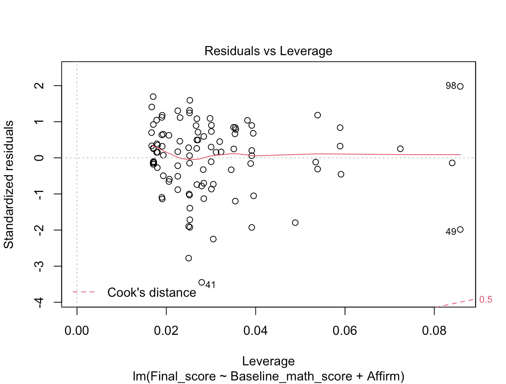

```{r setup, include=FALSE}
options(htmltools.dir.version = FALSE)
library(xaringanthemer)
style_mono_accent(
  text_font_google = google_font("Montserrat", "300", "300i"),
  code_font_google = google_font("Fira Mono")
)
library(magrittr)
library(flair)

knitr::opts_chunk$set(warning = F, message = F)
```

<style>
:root {
  --font12: 12pt;
  --font10: 10pt;
  --font2: 2pt;
  --nyu-yellow: #ecaa00;
  --nyu-red: #c50f3c;
  --nyu-violet: #57068c;
}

.font12 > table {
  font-size: var(--font12);
}

.font12 > p {
  font-size: var(--font12);
}

.font12 > ul {
  font-size: var(--font12);
}

.font12 > pre .remark-code-line {
  font-size: var(--font12);
}

.font10 > table {
  font-size: var(--font10);
}

.font10 > p {
  font-size: var(--font10);
}

.font10 > pre .remark-code-line {
  font-size: var(--font10);
}

.font10 > pre {
  font-size: var(--font10);
}

.font2 > pre {
  font-size: var(--font2);
}

.font10 .str_view {
  font-size: var(--font10);
}

.font10.rendered > pre {
  font-size: var(--font10);
  font-family: var(--code-font-family);
  background-color: #fdf6e3;
  color: #657b83;
  padding: 5px;
}

.yellow {
  color: var(--nyu-yellow);
}

.red {
  color: var(--nyu-red);
}

.violet {
  color: var(--nyu-violet);
}

.highlighted {
  background-color: var(--code-highlight-color);
}

.highlighted-block {
  font-family: var(--code-font-family), Menlo, Consolas, Monaco, Liberation Mono, Lucida Console, monospace;
}

.aligncenter {
    text-align: center;
}

</style>


# Before we get started...

--

- Last semester's workshop takes a lecture-style top-down approach and provides you with a rich source of functions & commands to build up your own R dictionary.

--

- This semester's workshop takes an interactive bottom-up approach (i.e. lots of quizzes and hands-on coding).

--

- Things that I wish I had been told when I started learning R:

--

  - **Coding is hard and intimidating!!!**

--

  - **You need to figure out early why you need it and what you need it for.**

--

  - **Time investment is huge and the reward is also huge.**

--

  - **99% of the answers to your questions are on Google. Stackoverflow, various R blogs, and R bookdown books are your friends.**

--

  - **Be problem-focused if you are a social scientist trying to learn R. Specify your problem (e.g. finding the mean), and find ways to execute it in R.**
  
--

- But don't worry, I'll try to hold your hands through the basics.

---
.aligncenter[

]
---
# Agenda

By the end of this workshop, you should be able to use R to conduct the following analysis:

- Descriptive analysis
- Chi-squared test
- Correlation
- T-test
- ANOVA
- Simple and multiple regression
- Model selection

Here is a list of packages that you need to run the codes:
```{r, eval = F}
# required packages
packages <- c("tidyverse", "psych", "here", "skimr", "tldr", "esquisse","broom", "texreg", "remotes")

# check package existence before installing them
install.packages(setdiff(packages, rownames(installed.packages())))  

# rcoder by Patrick
remotes::install_github("nyuglobalties/rcoder")
```

---

# Let's load our data!

Time to load the data: Notice that **Intervention** takes the value of 1 and -1, and **Female** takes the value of 0 and 1. This may be less intuitive in analysis, let's change the numeric values to their actual character labels!

```{r, results = "hide"}
library(tidyverse)
dat <- read_csv(here::here("data/sample_intervention_dataset.csv"))
head(dat)
```

```{r, echo = F}
DT::datatable(
  head(dat),
  options = list(pageLength = 3, 
  scrollX = T,
  scrollY = T,
  scrollCollapse = T,
  columnDefs = list(list(className = 'dt-center', targets="_all"))))
```

---

## Quiz!

Based on the following codebooks, use the `mutate()` and `if_else()` function to change the values of **Intervention** and **Female** to their corresponding labels. Without changing the values in the original variables, create two new variables called **Affirm** and **Gender**.

```{r, echo = F}
library(rcoder)
coding(code("Treatment", 1), code("Control", -1))
coding(code("Female", 1), code("Male", 0))
```

---

# Answer
```{r}
dat <- dat %>% 
  mutate(Affirm = if_else(Intervention == 1, "Treatment", "Control"),
         Gender = if_else(Female == 1, "Female", "Male")
         )
```

```{r}
table(dat$Affirm, dat$Intervention)
table(dat$Gender, dat$Female)
```

---

# Descriptive analysis with continuous variables

## 1. Do it manually
```{r}
mean(dat$Final_grade, na.rm = T)
sd(dat$Final_grade, na.rm = T)
median(dat$Final_grade, na.rm = T)
```

---

Using the `group_by()` function allows you to calculate things for each gender.

```{r}
dat %>% group_by(Gender) %>% 
  summarise(
    Final_grade_mean = mean(Final_grade, na.rm = T),
    Final_grade_sd = sd(Final_grade, na.rm = T),
    Final_grade_median = median(Final_grade, na.rm = T)
  )
```

---

## Quiz!

Find out the mode of `Final_grade` for each gender (`Female` or `Male`) in each intervention group (`Treatment` or `Control`). (hint: Google it!)

--
```{r}
# a function to generate the model
getmode <- function(v) {
   uniqv <- unique(v)
   uniqv[which.max(tabulate(match(v, uniqv)))]
}

dat %>% group_by(Gender, Affirm) %>% 
  summarise(
    Final_grade_mode = getmode(Final_grade)
  )
```


---
## 2. `psych::describe()`
```{r, results = "hide"}
dat.s <- dat %>% select(Final_grade:Baseline_stereotype_endorsement)
df <- psych::describe(dat.s) %>% 
  as.data.frame() %>%
  rownames_to_column(var = "varnames") %>%
  mutate_if(is.numeric, round, 3)
```

```{r, echo = F}
DT::datatable(
  df,
  options = list(pageLength = 4, 
  scrollX = T,
  scrollCollapse = F,
  columnDefs = list(list(className = 'dt-center', targets="_all"))))
```

---

## Quiz!

**Could you get descriptive statistics separately for females and males?**

Hints:
- Do it manually: use `group_by()` with pipes (`%>%`).
- Do it with an existing function: consider `psych::describe.by()`.

---

## 3. `skimr::skim()`
```{r, results = "hide"}
df <- skimr::skim(dat.s) %>% 
  mutate_if(is.numeric, round, 3)
```

```{r, echo = F}
DT::datatable(
  df,
  options = list(pageLength = 4, 
  scrollX = T,
  scrollCollapse = F,
  columnDefs = list(list(className = 'dt-center', targets="_all"))))
```

---

## 4. Plots

```{r, fig.height=4, dpi = 300}
# histogram
hist(dat$Final_grade, main = "Final grades", xlab = "Distribution of final grades")
```

---

```{r, fig.height=4, dpi = 300}
# boxplot
boxplot(dat$Final_grade, main = "Final grades", ylab = "Distribution of final grades")
```

---

```{r, fig.height=4, dpi = 300}
# scatterplot
plot(dat$Final_grade, dat$Final_score, xlab = "Final grades", ylab = "Final scores")
```

---

# Descriptive analysis with categorical variables

## 1. Do it manually

.font10[
```{r}
table(dat$Affirm)
table(dat$Affirm, dat$Gender)
prop.table(table(dat$Affirm, dat$Gender))
```
]

---

## 2. `tldr::KreateTableOne`

.font10[
```{r, results = "hide"}
dat.s <- dat %>% select(Affirm, Gender, Cohort, Baseline_stereotype_endorsement)

gen.ftab <- function(data){
  
  x <- as.data.frame(sapply(data, as.character))
  
  ftab <- suppressMessages(tldr::KreateTableOne(x)) # suppress this
  var = rownames(ftab)
  ftab <- as.data.frame(ftab) %>% mutate(Variable = var, .before = 'Overall')
  
  return(ftab)
}

df <- gen.ftab(dat.s)
```
]

```{r, echo = F}
DT::datatable(
  df,
  options = list(pageLength = 4, 
  scrollX = T,
  scrollY = T,
  scrollCollapse = F,
  columnDefs = list(list(className = 'dt-center', targets="_all"))))
```

---

## 3. Plots

```{r, fig.height=4, dpi = 300}
# histogram
barplot(table(dat$Gender), main = "Frequency of gender")
```

---

# A much better way of plotting

`esquisse::esquisser()` is a `ggplot2::ggplot` builder that lets you explore your data quickly to extract the information (and the codes!) they hold. 

```{r, eval = F}
esquisse::esquisser()
```

### Let's walk through it together!

---

# Chi-squared test

We wish to know whether the assignment to treatment/control is independent from students' gender. We need to first create the contingency table to calculate the chi-squared statistic.

```{r}
cont.table <- table(dat$Affirm, dat$Gender)
chisq.test(cont.table)
```

--

## Quiz
Could you generate a contingency table without using the dollar sign (`$`) to refer to variables? (Hint: use `select()`)

---

The assumptions of the chi-squared test include: 
- The data in the cells should be frequencies, or counts of cases rather than percentages or some other transformation of the data. 
- The levels (or categories) of the variables are mutually exclusive.

**Hypothesis testing:**

- H0: Variable A and Variable B are independent.
 
- H1: Variable A and Variable B are not independent.

```{r}
chisq.test(cont.table)
```

$df = (r-1)(c-1) = (2-1)*(2-1) = 1$

**APA reporting:** From the results above, there is not a statistically significant relationship between treatment assignment and gender ( $\chi^2(1, N = 100) = 0.225, p = 0.636$ ).

---

# Correlation

```{r}
dat.s <- dat %>% select(Final_grade:Baseline_stereotype_endorsement)

# Pearson r correlation is the most widely used correlation statistic to measure the degree of the relationship between linearly related variables.
cor(dat.s, method = "pearson")

```


---

```{r}
# Spearman r correlation is a nonparametric measure of rank correlation (statistical dependence between the rankings of two variables)
cor(dat.s, method = "spearman")
```

---

**Hypothesis testing:**

- H0: Variable A and Variable B has a zero correlation.

- H1: Variable A and Variable B are non-zero correlation.

.font10[
```{r, eval = F}
psych::corr.test(dat.s, use = "complete")
psych::corr.test(dat.s, use = "pairwise")
psych::corr.test(dat.s, method = "spearman", use = "pairwise")
```

I have also prepared a function for you to add significance stars to the correlation matrix (**YES, function-writing is an essential part of the coding experience!**).

```{r}
corstarsl <- function(x){ 
x <- as.matrix(x) 
R <- Hmisc::rcorr(x)$r 
p <- Hmisc::rcorr(x)$P 

## define notions for significance levels; spacing is important.
mystars <- ifelse(p < .001, "***", ifelse(p < .01, "**", ifelse(p < .05, "*", "")))
## trunctuate the matrix that holds the correlations to two decimal
R <- format(round(cbind(rep(-1.11, ncol(x)), R), 3))[,-1] 
## build a new matrix that includes the correlations with their apropriate stars 
Rnew <- matrix(paste(R, mystars, sep=""), ncol=ncol(x)) 
diag(Rnew) <- paste(diag(R), " ", sep="") 
rownames(Rnew) <- colnames(x) 
colnames(Rnew) <- paste(colnames(x), "", sep="") 
## remove upper triangle
Rnew <- as.matrix(Rnew)
Rnew[upper.tri(Rnew, diag = TRUE)] <- "--"
Rnew[upper.tri(Rnew)] <- ""
Rnew <- as.data.frame(Rnew) 
## remove last column and return the matrix (which is now a data frame)
Rnew <- cbind(Rnew[1:length(Rnew)])
return(Rnew) 
} 
```
]

---

The output looks like this:

```{r, results="hide"}
corstarsl(dat.s)
```

```{r, echo = F}
DT::datatable(
  corstarsl(dat.s),
  options = list(pageLength = 4, 
  scrollX = T,
  scrollCollapse = F,
  columnDefs = list(list(className = 'dt-center', targets="_all"))))
```

**(\*\*\* 0.001, \*\* 0.01, \* 0.05)**

$df = N-2$

**APA reporting**: Baseline Math score is positively correlated with final exam scores: $r(98) = .41, p < .001$.

---

# T-test

T-test is used to compare two means. The common assumptions made when doing a t-test include those regarding the scale of measurement, random sampling, normality of data distribution, adequacy of sample size and equality of variance in standard deviation.

```{r}
# compared a mean to a constant value 
t.test(dat$Final_score, mu = 72)
```

The probability that we would observe a test statistic different from t* = 0.660 if the population mean really were 72.

---

.font10[
```{r}
# compare two independent means
t.test(Final_score ~ Gender, data = dat)

# summary stats for reporting
dat %>% group_by(Gender) %>% 
  summarize(m = mean(Final_score,na.rm = T),
            sd = sd(Final_score,na.rm = T))
```

**APA reporting**: Girls do not score differently on physics exams (M = 70.5, SD = 13.2) than boys (M = 74.1, SD = 12.4), $t(98) = -1.3232, p = .191$.

You can also conduct one-tailed tests with the `alternative` argument.

```{r, eval = F}
t.test(Final_score ~ Gender, alternative = "greater", data = dat) # x has a larger mean than y
t.test(Final_score ~ Gender, alternative = "less", data = dat) # x has a smaller mean than y
t.test(Final_score ~ Gender, alternative = "two.sided", data = dat) # x has a equal mean as compared to y
```

]

---

# ANOVA (Analysis of Variance)

ANOVA provides a statistical test of whether two or more population means are equal, and therefore generalizes the t-test beyond two means

**It is needed because We CANNOT do multiple t-tests!**

The ANOVA F-test is a comparison of the average variability between groups(Var_between) to the average variability within groups (Var_within).

$F = Var_{between}/Var_{within} = MS_B/MS_W$

Assumptions:
- observations drawn from random sample and independent from each other.
- observations normally distributed within each group.
- Variances approximately equal across groups

**Hypothesis testing:**

- H0: All means are equal across groups.

- H1: Not all means are equal across groups.

---

.font10[
```{r}
# single factor anova
fit <- aov(Final_score ~ Affirm, dat)
summary(fit)
```
]

**APA reporting**: There was not a significant effect of self-affirmation on course score at the p < .05 level for the two conditions ( $F(1, 98) = 1.834, p = 0.179$ ).

**Tukey HSD post-hoc diagnosis**: It is ‘protected’ against the inflated risk of Type I error that arises when multiple significance tests are performed.

In effect, the Tukey HSD uses a larger critical value to judge statistical significance than would be used in an ordinary t test, and the critical value for Tukey HSD increases as the number of comparisons of means increases.

.font10[
```{r}
TukeyHSD(fit)
```
]

---

You can also plot the subgroup difference(s):

```{r, fig.height=4, dpi = 300}
par(mfrow = c(1,1), mar = c(5,8,4,2), las = 1) 
# MultiFrame rowwise layout (mfrow), margin size (mar), axis label locations (mgp), and axis label orientation (las).
plot(TukeyHSD(fit))
```

---

```{r}
# double factor anova
fit <- aov(Final_score ~ Affirm*Gender, dat)
summary(fit)
```


`Affirm` has 2 levels, so df = (a - 1) = 1

`Gender` has 2 levels, so df = (b - 1) = 1

`Affirm` **:** `Gender`  df = (a - 1) x (b - 1) = 1

Observations n = 100

Total df = (n - 1) = 99

Residual (error) df = Total - (a-1) - (b-1) - (a-1) x (b-1)  = 96

Becasue there is no missingness, model df = 96 - 0 = 96

**APA reporting**: A two-way ANOVA was conducted that examined if the effect of self-affirmation on course score was moderated by students' gender. There was not a statistically significant interaction between the effects of affirmation and gender on course score ( $F (1, 96) = 0.692, p = .408$ ).

---

Interaction effects are difficult to interpret, plot it!

```{r, results = "hide", echo = F}
dev.off()
```

```{r, fig.height=4, dpi = 300}
with(dat, interaction.plot( Gender, Affirm, Final_score, 
                           type = "b", col = c("red", "blue"), 
                           pch = c(16,18)))
```

---

# Simple regression

We use the `lm()` function to build linear regression models.

```{r}
fit1 <- lm(Final_score ~ Baseline_math_score, dat)
summary(fit1) 
```

---

## Quiz!

Use the ggplot builder to generate a scatterplot with `Baseline_math_score` on the x axis and the `Final_score` on the y axis. Copy the code and manually adjust `method = ""` in the `geom_smooth()` function to change the fitted line from loess to linear.

---

```{r, fig.height=4, dpi = 300}
ggplot(dat, aes(x = Baseline_math_score, y = Final_score)) + 
  geom_point() +
  geom_smooth(method = "lm", fill = NA) +
  theme_bw()
```

---

```{r}
# add a quadratic term
fit2 <- lm(Final_score ~ Baseline_math_score + I(Baseline_math_score^2) + I(Baseline_math_score^3) , data = dat)
summary(fit2)
```

---

```{r, fig.height=4, dpi = 300}
ggplot(dat, aes(x = Baseline_math_score, y = Final_score)) + 
  geom_jitter() +
  geom_smooth(method = "lm", color = "blue", fill = NA) +
  geom_smooth(method = "lm", formula = y ~ x + I(x^2), color = "red") + 
    geom_smooth(method = "lm", formula = y ~ x + I(x^2) + I(x^3), color = "green")+
  theme_bw()
```

---

# Multiple regression

Building multiple regression is also easy as you can add many predictors into the same equation.

```{r}
M1 <- lm(Final_score ~ Baseline_math_score, data = dat)
M2 <- lm(Final_score ~ Baseline_math_score + Affirm, data = dat)
M3 <- lm(Final_score ~ Baseline_math_score + Affirm*Gender, data = dat)
M4 <- lm(Final_score ~ Baseline_math_score + Affirm*Gender + Cohort, data = dat)
```

The `lm` output is useful enough if you just want to read it. However, you would need to run something like `coef(summary(fit))` to extract the coefficients and put them into tabular data. Model comparison is also annoying if you run `summary()` on each model. 

Here are a few existing packages to help you with table generation of model outputs.

---

# `broom::tidy`

`broom::tidy` gives you a nice tabular output of your model. Note it also works with all the statistical methods I've talked about so far!

.font10[
```{r}
# estimates
broom::tidy(fit1)
# model fit
broom::glance(fit1)
```
]

---

# `texreg::htmlreg`

`texreg::htmlreg` is probably the most handy function to generate tables of model comparisons. 

Note `texreg::texreg` gives you LaTex output, `texreg::wordreg` gives you a word table, and `texreg::screenreg` allows you to quickly see the output in R console. You need to specify `results = "asis"` in the chunk header to knit the results.

---

.font10[
```{r, results = "asis"}
texreg::htmlreg(
  list(M1,M2,M3,M4),
  custom.model.names = c("M1", "M2", "M3", "M4"),
  caption = "Test models",
  digits = 3
)
```
]

---

# Regression diagnostics

Assumptions:

- Linearity: The relationship between X and the mean of Y is linear.

- Homoscedasticity: The variance of residual is the same for any value of X.

- Independence: Observations are independent of each other.

- Normality: For any fixed value of X, Y is normally distributed.

---

```{r, fig.height=5, dpi=300}
par(mfrow = c(2,2))
plot(M2)
```

---

# Residuals vs. fitted plot

.pull-left[

]

.pull-right[
The plot of residuals versus predicted values is useful for checking the assumption of **linearity and homoscedasticity**. 

If the model does not meet the linear model assumption, we would expect to see residuals that are very large (big positive value or big negative value). To assess the assumption of linearity we want to ensure that **the residuals are not too far away from 0** (standardized values less than -2 or greater than 2 are deemed problematic). To assess if the homoscedasticity assumption is met we look to make sure that **there is no pattern in the residuals and that they are equally spread around the y = 0 line**.
]

---

# QQ plot

.pull-left[

]

.pull-right[
The **normality** assumption is evaluated based on the residuals and can be evaluated using a QQ-plot (plot 2) by comparing the residuals to "ideal" normal observations. 

**Observations lie well along the 45-degree line in the QQ-plot**, so we may assume that normality holds here.
]

---

# Scale-location plot

.pull-left[

]

.pull-right[
The third plot is a scale-location plot (square rooted standardized residual vs. predicted value). This is useful for checking the assumption of **homoscedasticity**. In this particular plot we are checking to see if there is a pattern in the residuals.

The assumption of **a random sample and independent observations** cannot be tested with diagnostic plots. It is an assumption that you can test by examining the study design.
]

---

# Residual vs. leverage plot

.pull-left[

]

.pull-right[
The fourth plot is of "Cook's distance", which is a measure of **the influence of each observation on the regression coefficients**. 

The Cook's distance statistic is a measure, for each observation in turn, of the extent of change in model estimates when that particular observation is omitted. **Any observation for which the Cook's distance is close to 1 or more**, or **that is substantially larger than other Cook's distances** (highly influential data points), requires investigation.
]

Outliers may or may not be influential points. **Influential outliers are of the greatest concern**. They should never be disregarded. Careful scrutiny of the original data may reveal an error in data entry that can be corrected. If they remain excluded from the final fitted model, they must be noted in the final report or paper.

---
#Thank you!
---
