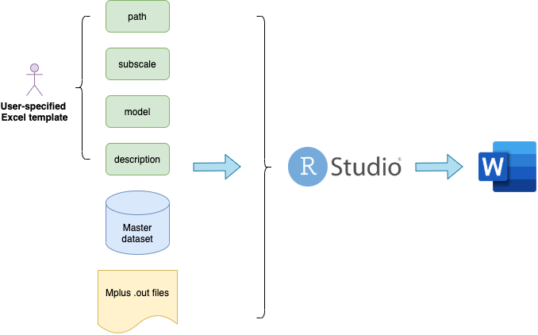
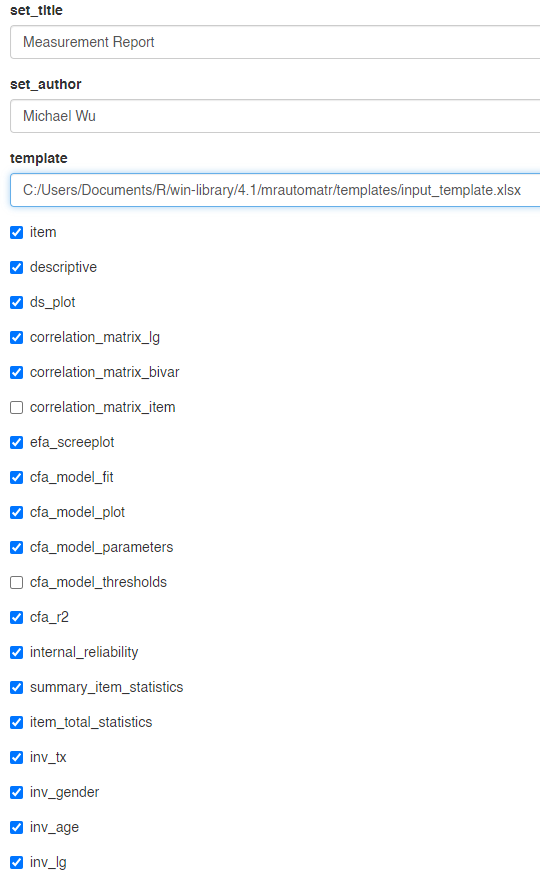

```{r setup, include=FALSE}
options(htmltools.dir.version = FALSE)
library(xaringanthemer)
style_mono_accent(
  text_font_google = google_font("Montserrat", "300", "300i"),
  code_font_google = google_font("Fira Mono")
)
library(magrittr)
library(flair)

knitr::opts_chunk$set(warning = F, message = F)
```

<style>
:root {
  --font12: 12pt;
  --font10: 10pt;
  --font2: 2pt;
  --nyu-yellow: #ecaa00;
  --nyu-red: #c50f3c;
  --nyu-violet: #57068c;
}

.font12 > table {
  font-size: var(--font12);
}

.font12 > p {
  font-size: var(--font12);
}

.font12 > ul {
  font-size: var(--font12);
}

.font12 > pre .remark-code-line {
  font-size: var(--font12);
}

.font10 > table {
  font-size: var(--font10);
}

.font10 > p {
  font-size: var(--font10);
}

.font10 > pre .remark-code-line {
  font-size: var(--font10);
}

.font10 > pre {
  font-size: var(--font10);
}

.font2 > pre {
  font-size: var(--font2);
}

.font10 .str_view {
  font-size: var(--font10);
}

.font10.rendered > pre {
  font-size: var(--font10);
  font-family: var(--code-font-family);
  background-color: #fdf6e3;
  color: #657b83;
  padding: 5px;
}

.yellow {
  color: var(--nyu-yellow);
}

.red {
  color: var(--nyu-red);
}

.violet {
  color: var(--nyu-violet);
}

.highlighted {
  background-color: var(--code-highlight-color);
}

.highlighted-block {
  font-family: var(--code-font-family), Menlo, Consolas, Monaco, Liberation Mono, Lucida Console, monospace;
}

.aligncenter {
    text-align: center;
}

</style>

# Motivation

--

- Have you ever been frustrated by transporting tables from Mplus and Stata to Word?

--

- Have you ever spent hours fiddling with table formatting in Word?

--

- Have you imagined that one day you can get all the tables and plots the minute you finish your analysis?

--

.aligncenter[

**Now is your chance to try**

### `mrautomatr`###
]

--

.aligncenter[

]

---

# Use `mrautomatr` for TIES work

--

- NYU Global TIES for Children (2021). “Understanding and improving the learning and development of children in low-income and crisis-affected countries: Toward research impact at scale.” *Proposal to NYUAD Research Institute for renewed core support.*
  
  - Strategy 5: Development and sharing of global public goods

--

- Building consistent and streamlined measurement reports for the measurement library and for donors and collaborators

--

- Efficient generation of intermediate test reports for results compiling and internal reporting purposes at any stage of your analysis

--

- Consistent [**naming rules**](https://nyu.app.box.com/s/ate5l7wmw164u7xjg3g8x1vrfhwnt0ax) of variables and files 

---

# What is `mrautomatr`?

--

- It is an R package powered by `flextable` and `rmarkdown`, two wonderful open-source R pacakges.

--

- It takes your master dataset (`.csv/.dta/.xlsx`) and your Mplus output file (`.out`) and generates a measurement report for you.

--

- It requires *very few* prior knowledge in R programming.

--

- All you need to do is:

--

--

  - Put your files in place

--

  - Fill in an excel sheet indicating 
      - Where the files are located
      - The name of your measure and items
      - What data/output files to use
      - Some descriptions of your measure

--
      
  - Run a few lines of code in R
 
--

- And **BOOM!**, you get yourself a well-formatted measurement report in Microsoft Word!

---

# A simple roadmap

.aligncenter[

]

The preparation of files takes about **5-10 minutes**. Generating one report in R typically takes **less than 2 minutes** once you get familiar with the package.

---

.aligncenter[

]

---

.aligncenter[### Let's take a look at [**the report**](https://nyu.box.com/s/jgoa9suhsfli34ce0q7xkonpuyzw2sno)!
]

--

- If you are interested in learning more about `mrautomatr`, feel free to:

  - Join the next R workshop exclusively designed to introduce this package in a not-so-technical way (date TBD)
  
  - Visit the package bookdown website, and follow all the steps: https://bookdown.org/wuzezhen33/mrautomatr/
  
  - Try the package on your own data and let us know what works and what does not by opening a new GitHub issue at https://github.com/nyuglobalties/mrautomatr/issues.

--

- What is next:

  - Potential integration with the `kfa` (k-fold factor analysis) R package that the UNC team is developing
  
  - Potential integration with Stata and SEM analysis software besides Mplus
  
  - Potential extension to include reporting of IRT models

---

# Thank you!

